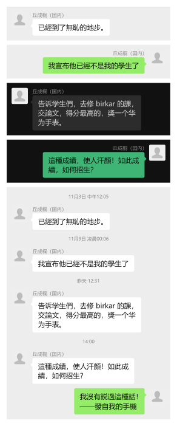
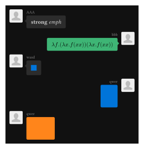
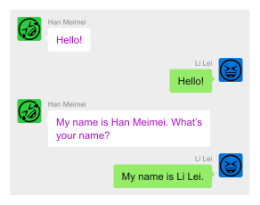

# Ourchat

Let's forge chat messages!





## Usage and Examples

More examples can be found in `examples/*.typ`.

```typst
#import "@preview/ourchat:0.1.0" as oc: default-profile

// You can set global styles here.
#set page(width: auto, height: auto, margin: 1em, fill: none)
#set text(font: "Microsoft YaHei")

// Here we provide a default profile for the left user.
#oc.chat(
  left-profile: default-profile,
  oc.datetime[11月3日 中午12:05],
  oc.message(left, name: [丘成桐（囯內）])[
    已經到了無恥的地步。
  ],
  oc.datetime[11月9日 凌晨00:06],
  oc.message(left, name: [丘成桐（囯內）])[
    我宣布他已經不是我的學生了
  ],
  oc.datetime[昨天 12:31],
  oc.message(left, name: [丘成桐（囯內）])[
    告诉学生們，去修 birkar 的課，交論文，得分最高的，獎一个华为手表。
  ],
  oc.datetime[14:00],
  oc.message(left, name: [丘成桐（囯內）])[
    這種成績，使人汗顏！如此成績，如何招生？
  ],
  oc.message(right, profile: default-profile)[
    我沒有説過這種話！

    ——發自我的手機
  ],
)
```

You can use any image (or something else) as the user profile.

We provide `light` and `dark` themes (the default is `light`). You can provide a custom theme by passing a dictionary to the `chat` function.
